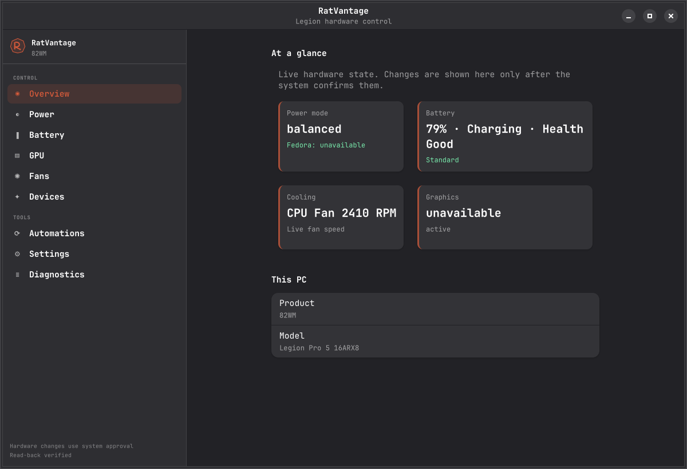
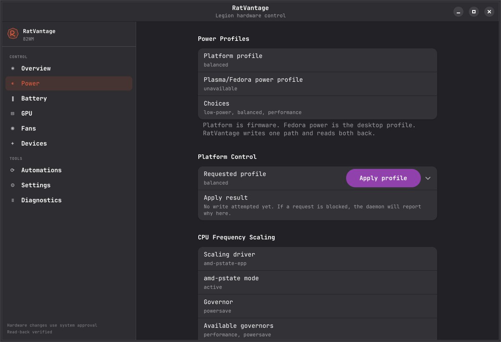

# RatVantage

RatVantage is a Fedora-native dashboard and tray application for safely managing
Lenovo Legion laptop power, battery, GPU, cooling, and lighting features through
Linux interfaces.

It includes:

- a GTK4/libadwaita dashboard;
- a StatusNotifier tray menu;
- read-only hardware and capability discovery;
- a polkit-gated system daemon for approved hardware writes;
- profiles, automations, diagnostics, and recovery feedback.

RatVantage is not affiliated with or endorsed by Lenovo.

## Preview

<p align="center">
  
  
</p>

The dashboard exposes only capabilities detected on the current machine, so
available pages and controls vary by hardware and daemon configuration.

## Hardware support

RatVantage detects capabilities at runtime. A feature appears only when the
running system exposes a supported Linux interface.

| Device | Product type | Status | Notes |
|---|---|---|---|
| Lenovo Legion Pro 5 16ARX8 | 82WM | Confirmed beta target | Fedora 43; platform, battery, CPU, GPU power, LED, firmware-attribute, profile, and automation paths tested |

### Devices in testing

No additional models are currently under review.

Other Legion systems may already expose compatible interfaces, but that does not
automatically confirm every control. Read support and write support are reviewed
per capability and per product type.

To submit another model:

```bash
scripts/capture-compat-report.sh --output compat/<machine-label>
```

Review the generated bundle before submitting it. Remove serial numbers, UUIDs,
machine IDs, MAC addresses, account names, personal paths, and unrelated logs.
See [Fixture capture](docs/fixture-capture.md) for the current contribution flow.

The capture and PR-body generator already exist. The reviewed device-manifest,
automatic classification, generated README table, and dedicated compatibility CI
workflow are designed but not implemented yet. See the
[hardware compatibility intake plan](docs/hardware-compatibility-intake-plan.md).

## What works

- Platform and Fedora power-profile synchronization
- Battery charge and conservation controls
- CPU governor, EPP, boost, and scaling limits
- AMD GPU power-state controls
- Supported LEDs, firmware attributes, and platform toggles
- Evidence-backed OpenRGB keyboard control
- Hardware profiles and automation rules
- Fan and temperature telemetry
- Diagnostics, drift detection, rollback, and recovery feedback

Higher-risk fan-curve execution and unpromoted runtime GPU switching remain
plan-only until model-specific live evidence proves safe readback and recovery.

## Safety

- The dashboard and tray never run as root.
- Privileged writes go through the daemon and polkit.
- Writes are disabled by default.
- No raw EC writes, raw WMI calls, arbitrary sysfs writes, firmware flashing, or
  overclocking shortcuts are exposed.
- Write support requires validation, explicit daemon flags, readback,
  rollback/reset behavior, tests, and live evidence.

See [Safety model](docs/safety-model.md) and
[Write contracts](docs/write-contracts.md).

## Build and test

From a RatVantage source checkout:

```bash
rustup toolchain install stable
./scripts/install-dev-deps-fedora.sh
./scripts/ci-local.sh
./scripts/validate-release-packaging.sh
```

Run against the confirmed fixture without Legion hardware:

```bash
cargo run -p legion-probe -- --json --sysfs-root tests/fixtures/sysfs-82wm-confirmed
scripts/run-local-session-app.sh --frontend status
scripts/run-local-session-app.sh --frontend tray
scripts/run-local-session-app.sh --frontend ui --gsk-renderer cairo
```

The dashboard and tray run as the logged-in user. Only
`legion-control-daemon` runs as a system service. Packaged service metadata is
read-only by default and does not enable hardware writes.

## Documentation

- [Architecture](docs/architecture.md)
- [Hardware compatibility intake plan](docs/hardware-compatibility-intake-plan.md)
- [Hardware control matrix](docs/hardware-control-matrix.md)
- [Fixture capture](docs/fixture-capture.md)
- [Live write validation](docs/live-write-validation.md)
- [Fedora packaging](docs/fedora-packaging.md)
- [Release checklist](docs/release-checklist.md)
- [Contributing](CONTRIBUTING.md)
- [Support](SUPPORT.md)
- [Security](SECURITY.md)

## License

MIT. See [LICENSE](LICENSE).
